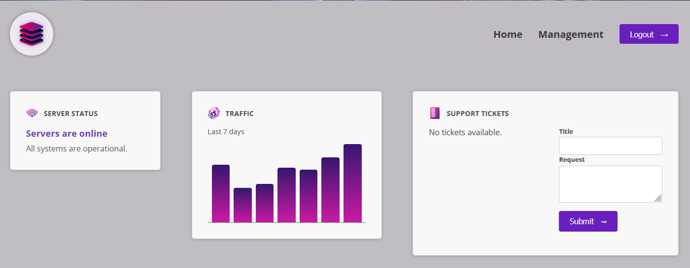
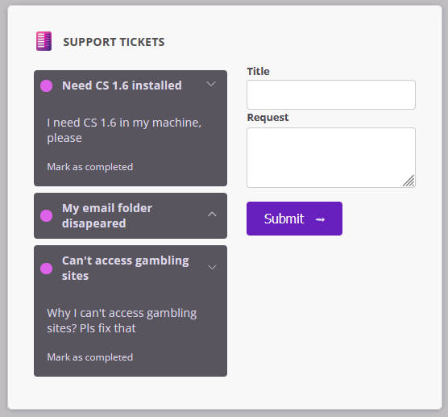
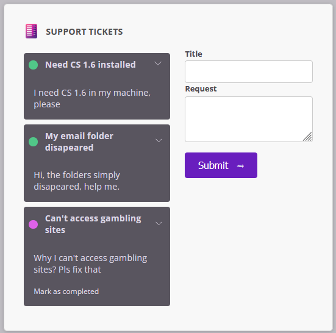
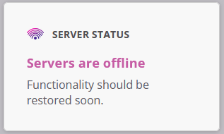
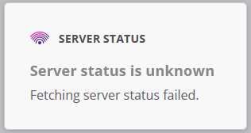

# 📝 Support Ticket Management

**Support Ticket Management** é um projeto Angular desenvolvido para fins de estudo, simulando gerenciamento de tickets de suporte.

---

## 🚀 Tecnologias Utilizadas

- [Angular 20](https://angular.io/)
- TypeScript
- HTML5 & CSS3
- Vite (via Angular CLI)
- Node.js & npm

---

## ✨ Funcionalidades

- Criar, listar e concluir tickets
- Marcar tickets como concluídos
- Monitorar status de servidor fictício (online, offline, desconhecido)
- UI simples e direta, com responsividade básica
- Arquitetura baseada em componentes standalone

---

## 📸 Screenshots

### 🏠 Home Page

### ➕ Criando Tickets

### ✅ Marcando Tickets como Concluídos

### 🔴 Status do Servidor Offline

### ❓ Status do Servidor Desconhecido

---

## 🛠️ Como Rodar o Projeto

### Pré-requisitos

- Node.js (v18 ou superior)
- npm (v9 ou superior)
- Angular CLI instalado globalmente

### Instalação

1. Instale as dependências com "npm install"

2. Rode o projeto com "ng serve"

A aplicação estará disponível em http://localhost:4200.

---

## 💭 Considerações Finais

Este projeto foi desenvolvido com Angular como parte de um portfólio pessoal, com foco em aprendizado e prática de desenvolvimento front-end moderno.
